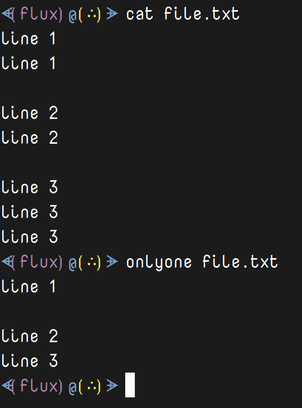

# OnlyOne 


---

<details>
<summary><b>Note</b>: <i>New Version</i></summary>
This is being re-written in C++ in a new feature (<i>switch</i>) for <i>case insensitivity</i> and the ability to read <i>piped stdin</i> or from <i>passed arguments</i>. <b>Coming soon</b>.
</details>

---

<a class="twitter-share-button"
  href="https://twitter.com/share?ref_src=twsrc%5Etfw&text='OnlyOne'%20-%20Print%20unique%20lines%20to%20a%20console.%0ACross-platform%20for%20%23Windows%2C%20%23Linux%2C%20and%20%23MacOs%20written%20in%20%23RustLang%0A%23Programming%20%23Coding%20via%20%40thefluxapex"></a> this project.

- [OnlyOne](#onlyone)
  - [About](#about)
    - [Description](#description)
    - [Motivation](#motivation)
    - [Development](#development)
  - [Usage](#usage)
    - [File Permissions](#file-permissions)
    - [Installation](#installation)
      - [Debian Installer](#debian-installer)
        - [Install By (Double) Clicking](#install-by-double-clicking)
        - [Install Command Line Method](#install-command-line-method)
        - [Uninstall Command  Line Method](#uninstall-command--line-method)
      - [Portable Usage](#portable-usage)
        - [Operating System PATH](#operating-system-path)
    - [Environment Usage](#environment-usage)
      - [Operating System Environment](#operating-system-environment)
      - [Command Line Environment](#command-line-environment)
    - [Examples](#examples)
  - [Links](#links)
    - [Project Links](#project-links)
    - [File Links](#file-links)
  - [Project Status](#project-status)
    - [Overall Status](#overall-status)
    - [Latest Version Status](#latest-version-status)
      - [Latest Build Status](#latest-build-status)
  - [Media](#media)
    - [Logo](#logo)
    - [Screen Shots](#screen-shots)
      - [Help Screen](#help-screen)
      - [Demo Screen](#demo-screen)
  - [LICENSE](#license)

## About

### Description

Print unique lines from a file. Similar to using something like '|sort|uniq', but without sorting.

### Motivation

- I wanted a better solution than `|sort|uniq` to get unique lines from a file. I use this to truncate *.bash_history* especially since I use `fzf` to search history.
- I like to make my own utilities even if there are viable alternatives.

### Development

This program is written in the programming language ***Rust*** and maintained, built, and tested here at this *GitHub* repository and pre-built and pre-tested on personal *Linux* and *Windows* machines.

## Usage

This is a *cross-platform* command line tool in binary executable format that can be used in *command lines*/*consoles*/*terminals*/*ttys*/*shells* in **Linux**, **Windows**, and **MacOs**.

This program's name has various versions, but they should all be renamed to: `onlyone`.

### File Permissions

 The main program file is meant to be executable and in *Windows* that's not usually an issue, but in *Linux* and *MacOs* you may need to set the permissions.

 In a *Linux* or *MacOs* command line run:

```Bash
# executable for all users
chmod +x /path/to/onlyone
# or
chmod 755 /path/to/onlyone 
# executable for current user only
chmod u+x /path/to/onlyone 
```

### Installation

This program is portable, but there is a *Debian* (*.deb* file) package installer for the *Linux* binary version.

#### Debian Installer

The file: *onlyone.deb* is a *Linux Debian* package installer for use on most *Linux Debian* based operating systems.

##### Install By (Double) Clicking

Like many other executable files this should be able to be clicked or double clicked to execute and it should open in the systems software manager gui.

##### Install Command Line Method

Install from command line with:

```Bash
sudo dpkg -i /path/to/onlyone.deb
```

I imagine this can be installed with *gdebi*, but I'm not familiar with it.

Uninstall with:

##### Uninstall Command  Line Method

```Bash
sudo apt remove onlyone
# -y to skip prompt approval
```

#### Portable Usage

Portable applications do not need to be installed, but they are easier to use if they are in one of a systems `PATH` directories.

If the program file is not in `PATH` (or in the current directory) then you must run it with the complete path url:

```Shell
/path/to/onlyone --help
```

or

```PowerShell
& '\Path\To\onlyone.exe' --help
```

If the file is place in `PATH` then you can run it with:

```Shell
onlyone --help
```

##### Operating System PATH

`PATH` directories are stored and can listed in the various operating systems `PATH` variable.

E.g.
```Shell
echo "$PATH"
```

|Operating System|Variable Name|
|:---:|:---:|
|Linux|$PATH|
|MacOs|$PATH|
|Windows|%PATH%|

### Environment Usage

Used in many command lines across 3 main operating systems (and more). 

#### Operating System Environment

3 main operating systems:

- Linux
- Windows
- MacOs

#### Command Line Environment

Used in any command line environment from *Linux Shell* to *Windows PowerShell*.

- Windows
  - CMD
  - PowerShell
- Linux
  - Shell
  - Bash
  - Zsh
  - many more...
- MacOs
  - Same as Linux I imagine.

### Examples

Get unique lines in a file:

```Shell
 $ # first read file.txt contents
 $ cat file.txt
line 1
line 1

line 2
line 2

line 3
line 3
line 3
 $ # get unique lines
 $ onlyone file.txt
line 1

line 2
line 3
```

Get unique line count:

```Shell
 $ cat file.txt|wc -l
9
 $ onlyone file.txt|wc -l
4
```

Help:

```Shell
 $ onlyone --help

 Print unique lines.
 E.g. onlyone /path/to/file

 @USAGE:
	onlyone FILE...
	onlyone [OPTIONS...]...
	onlyone [OPTIONS...]... FILE...

 @FILE:
	File		Any file to read.

 @OPTIONS:
	-h,--help	This HELP message.

 @ERRORS: Integers - Exit Codes.
	0		No errors.
	1		No parameters passed.
	2		No valid file passed.
	3		Path does not exist.
	4		Could not read file.
	5		No lines in file.
	6		Error while reading line.

```

## Links

All links pertinent to this project. 

All of the most current, up-to-date files are located on the 'Stable Release' page.

### Project Links

Current project links.

|Description|Link|
|:---|:---|
|Main repository.|[https://github.com/Lateralus138/onlyone](https://github.com/Lateralus138/onlyone)|
|Main repository - themed version.|[https://lateralus138.github.io/onlyone](https://lateralus138.github.io/onlyone)|
|Current Releases|[https://github.com/Lateralus138/onlyone/releases](https://github.com/Lateralus138/onlyone/releases)|
|Stable Release|[https://github.com/Lateralus138/onlyone/releases/tag/1.0.0.0](https://github.com/Lateralus138/onlyone/releases/tag/1.0.0.0)|


### File Links

Current release files.

These are all the files included under 'Stable Release' on the 'Current Releases' page.

|File Name|Description|Link|
|:---|:---|:---|
|onlyone.deb|Debian package installer.|[./target/release/onlyone.deb](https://cdn.jsdelivr.net/gh/Lateralus138/onlyone@debian/target/release/onlyone.deb)|
|onlyone_linux|Main Linux executable.|[./target/release/onlyone_linux](https://cdn.jsdelivr.net/gh/Lateralus138/onlyone@linux/target/release/onlyone_linux)|
|onlyone_darwin|Main MacOS executable.|[.target/release/onlyone_darwin](https://cdn.jsdelivr.net/gh/Lateralus138/onlyone@macos/target/release/onlyone_darwin)|
|onlyone_windows.exe|Main Windows executable.|[./target/release/onlyone_windows.exe](https://cdn.jsdelivr.net/gh/Lateralus138/onlyone@windows/target/release/onlyone_windows.exe)|

## Project Status

### Overall Status

|Description|Status|
|:---:|:---:|
|Project Release Date||
|Total downloads for this project||
|Complete repository size||
|Commits in last month||
|Commits in last year||

### Latest Version Status

|Description|Status|
|:---:|:---:|
|Release version||
|Tag version||
|Total downloads for current version||

#### Latest Build Status

|Name|Status|Code Quality|
|:---:|:---:|:---:|
|Linux: `Build`/`Publish`|||
|Debian: `Build`/`Publish`|||
|Windows: `Build`/`Publish`|||
|Macos: `Build`/`Publish`|||

## Media

### Logo


### Screen Shots

#### Help Screen


#### Demo Screen



## [LICENSE](./LICENSE)


>This program is free software: you can redistribute it and/or modify it under the terms of the GNU General Public License as published by the Free Software Foundation, either version 3 of the License, or (at your option) any later version.

>This program is distributed in the hope that it will be useful, but WITHOUT ANY WARRANTY; without even the implied warranty of MERCHANTABILITY or FITNESS FOR A PARTICULAR PURPOSE.  See the GNU General Public License for more details.